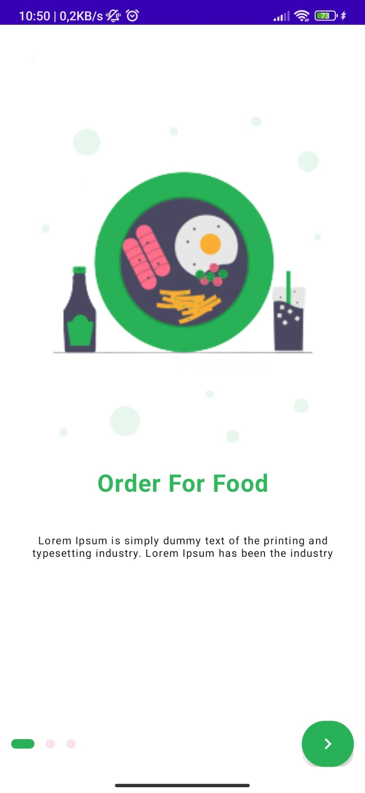
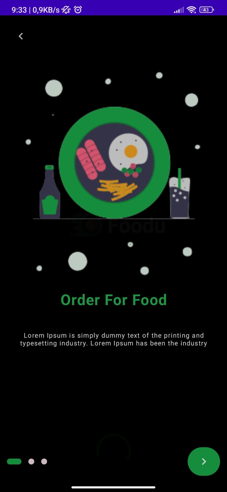
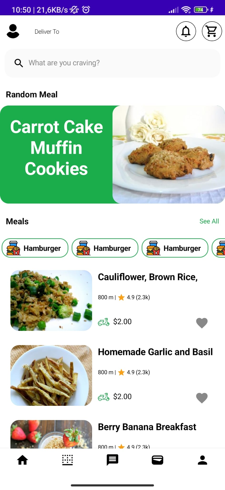
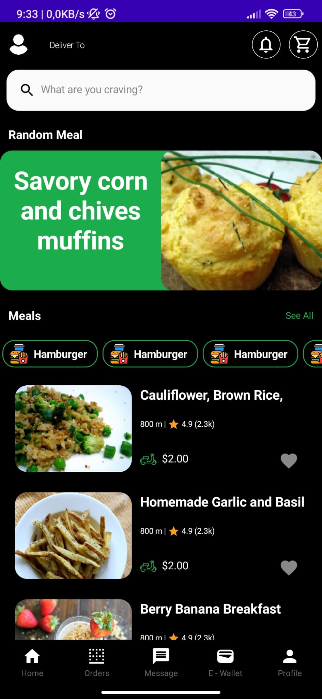
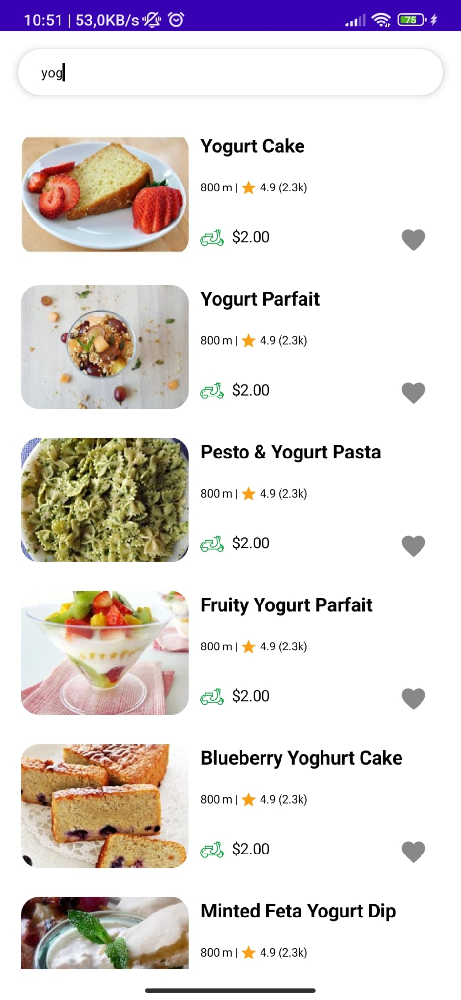
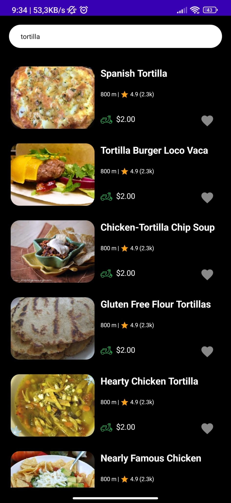
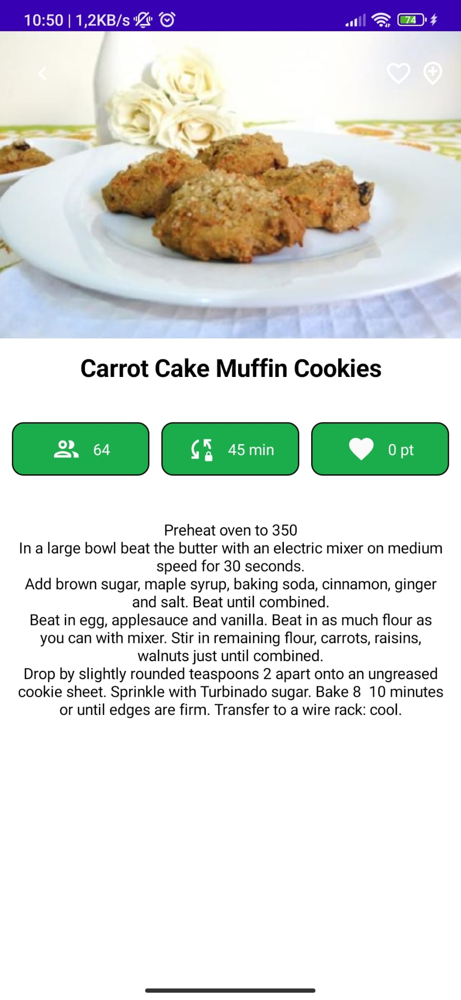
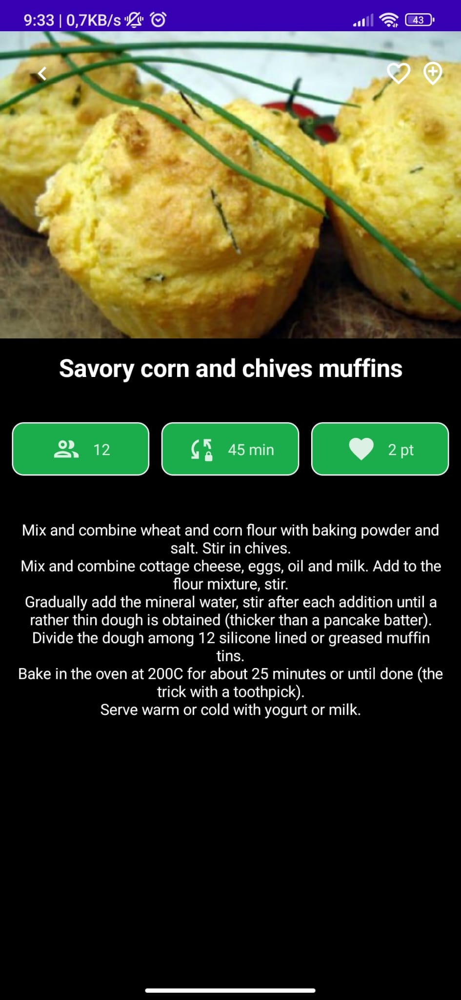

# Foodu 🍲

Foodu, yemek listesi ve detaylarının görülebileceği, yemek arama özelliğine sahip bir uygulama.

# Uygulama Görüntüleri

    
     
    
    
    

# API 

API:
https://spoonacular.com/food-api/docs

# Kullanılan Teknolojiler

<ul>
  <li>Kotlin</li>
  <li>MVVM Architecture</li>
  <li>Jetpack Compose</li>
  <li>Dagger Hilt</li>
  <li>Coroutines</li>
  <li>ViewModel</li>
  <li>Retrofit</li>
  <li>Coil</li>
  <li>Navigation</li>
</ul>

